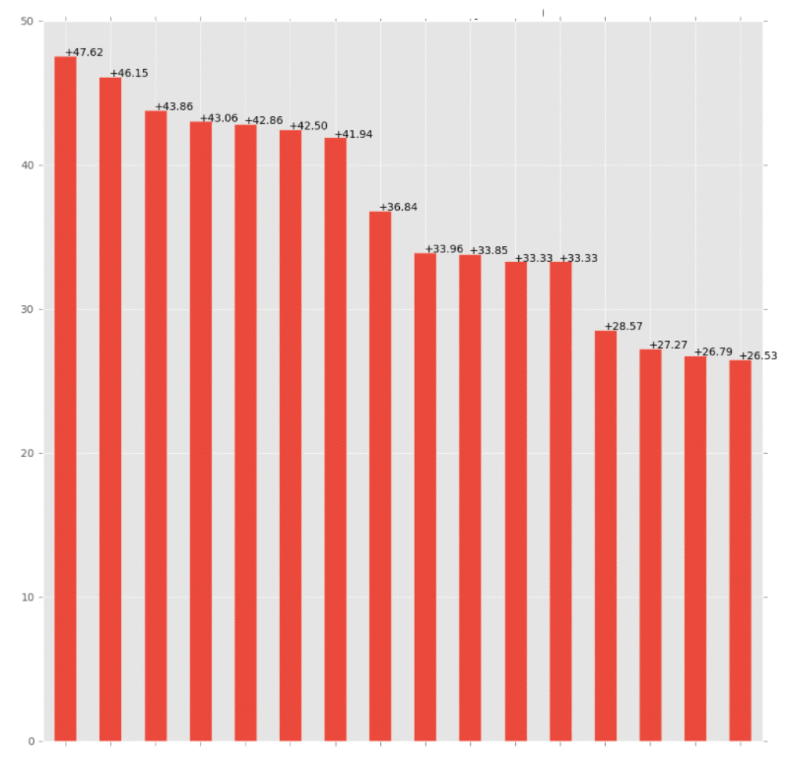
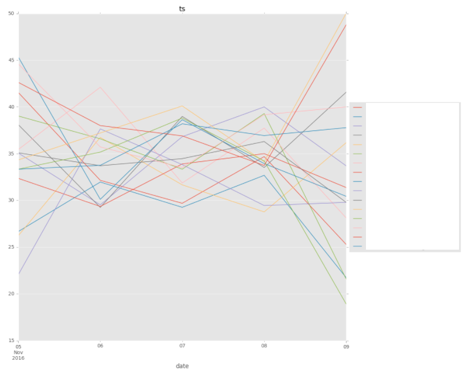
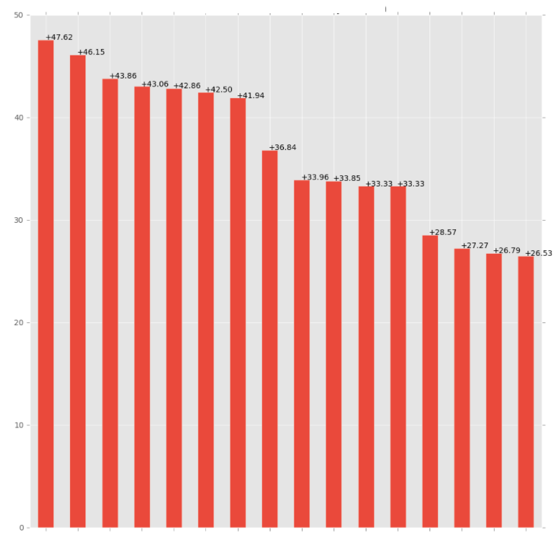
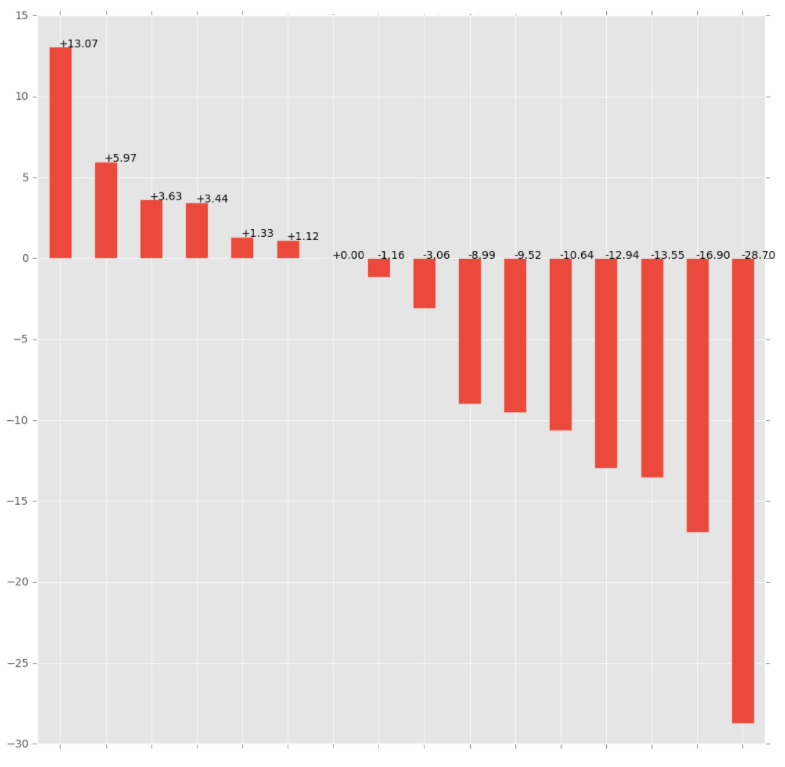

# reporting_ga

Simple framework using Google Analytics API with python+pandas to do quick visualization focused on goals.




## Setup

- Follow this tutorial to get creds: https://developers.google.com/analytics/devguides/reporting/core/v4/quickstart/installed-py

- Dependencies (don't know if it works with py2): 

  ```python
  pip3 install -r requirements.txt
  ```

- Create config.ini at the root

```markdown
[Creds]
VIEW_ID: ID_GA
CLIENT_SECRETS_PATH: client_secret.json

[ConfProject]
folder: FOLDER_NAME/
```


## Example

- Launch notebook:

```bash
jupyter notebook
```

- Create object:

```python
d = g.AnalyticsData(start_date="", end_date="", dimension="", metric="", goal="", version="", filter_data='')
```

| Name        | Description       | Example                        |
| ----------- | :---------------- | ------------------------------ |
| start_date  | Starting date     | "2016-08-05"                   |
| end_date    | Ending date       | "yesterday"                    |
| dimension   | Dimensions        | "date,deviceCategory,userType" |
| metric      | Metrics           | "sessions"                     |
| goal        | If you have goals | "goalXCompletions"             |
| version     | String            | "dimensionXX"                  |
| filter_data | String            | ga:dimension5=~^(New)          |

All the parameters have to follow this guide: https://developers.google.com/analytics/devguides/reporting/core/dimsmets without the "ga:" except for filter_data parameter.

 

- Retreive data

```python
df = d.get_full_data()
```


- Graph

input:

```python
d.ts(df)
```

output:




## Documentation


### .ts()

| Name       | description                              |
| ---------- | ---------------------------------------- |
| df         | data to pass (pandas dataframe)          |
| filter_dim | Filter data by one of the dimension's name requested |
| filter_val | Filter data by one of the dimension's value requested |
| ylim       | min and max limit of the graph           |
| title      | Title of the graph                       |

#### ts example

```python
d.ts(df, filter_dim='deviceCategory', filter_val='desktop', title='My time series graph')
```


### .bar()

| Name       | Description                              |
| ---------- | ---------------------------------------- |
| filter_dim | Filter data by one of the dimension's name requested |
| filter_val | Filter data by one of the dimension's value requested |
| ylim       | min and max limit of the graph (tuple)   |
| title      | Title of the graph                       |

#### bar example

```python
d.bar(df, filter_dim='deviceCategory', filter_val='desktop', title='My time series graph', ylim(30,40))
```



### .diff()

| Name       | Description                              |
| ---------- | ---------------------------------------- |
| ref_dim    | the version to compare                   |
| filter_dim | Filter data by one of the dimension's name requested |
| filter_val | Filter data by one of the dimension's value requested |
| title      | Title of the graph                       |

#### diff example

```python
d.diff(df,ref_dim='Test version', filter_dim='deviceCategory', filter_val='desktop', title='My time series graph')
```


### .cumulative()

| Name       | Description                              |
| ---------- | ---------------------------------------- |
| filter_dim | Filter data by one of the dimension's name requested |
| filter_val | Filter data by one of the dimension's value requested |
| ylim       | min and max limit of the graph           |
| title      | Title of the graph                       |

#### cumulative example

```python
d.cumulative(df, filter_dim='deviceCategory', filter_val='desktop', ylim(30,40), title='My time series graph')
```


### .diff_cumul()

| Name       | Description                              |
| ---------- | ---------------------------------------- |
| filter_dim | Filter data by one of the dimension's name requested |
| filter_val | Filter data by one of the dimension's value requested |
| ref_dim    | the version to compare                   |
| title      | Title of the graph                       |
| ylim       | min and max limit of the graph           |

#### diff_cumul example

```python
d.diff_cumul(d,filter_dim='deviceCategory', ref_dim='Test version', filter_val='desktop', ylim(30,40), title='My time series graph')
```




## Next steps

- [ ] Add special functions for e-commerce websites.

- [ ] Add new api?

      ​